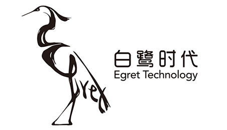
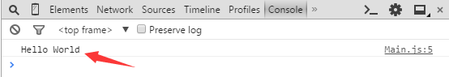

    

    
    
    
    

[EN](README.md) / [CN](README_CN.md)

# Egret Engine

The Egret Engine is a HTML5 game engine. It provides modules to handle common game development tasks such as 2D and 3D rendering, GUI systems, and audio and resource management. The Egret engine is flexible and suitable for 2D or 3D projects. It allows developers to work without worrying about low-level browser impelementation, HTML5 performance, or fragmentation issues.

## Platform Coverage 

### Mobile

### PC

# Installation

To Install the Egret Engine:

* [Download](https://egret.com/products/engine.html) the Egret Engine Manager.

* Then, follow the [installation and deployment instructions](http://developer.egret.com/cn/github/egret-docs/Engine2D/projectConfig/installation/index.html) 

Once installation is complete, Egret's engine and tools are easy to manage.

# Getting Started

#### TypeScript

Egret projects are developed using TypeScript, which is a superset of JavaScript. Please refer to the TypeScript manual for more information. The Egret API and ActionScript3 (AS3) are very similar. It will be easy to get started with Egret if you are familiar with AS3.

#### Create a project by command line

Use following command to create a default game object:

    egret create HelloWorld

You may also add parameters if required: Use `empty` | `game` | `gui` | `eui` to specify different projects. 

After running this command, you should now see a folder called 'HelloWorld'.

#### Write your first line of code

By default, the entry point for an Egret game projects is src / Main.ts. To make write the first line of code for your project, find the createGameScene () function, and add console.log ("Hello World");

After making your changes, the code should now look like this:

    private createGameScene():void {
            // log
            console.log("Hello World");
            var sky:egret.Bitmap = this.createBitmapByName("bgImage");
            this.addChild(sky);
            var stageW:number = this.stage.stageWidth;
            var stageH:number = this.stage.stageHeight;
            sky.width = stageW;
            sky.height = stageH;
            //...
        }

Here, we've called `console.log("log content that we'd like to display")`. This will display our log message in the browser's developer tool.

    We recommend using Chrome to debug the Egret project.

Use the following command to build Egret projects:

    egret build

Use the following command to run Egret projects:

    egret startserver

For more information, please refer to the Learning Module documentation.

# Demos

Tower Defence Demo

Click [here](http://developer.egret.com/cn/article/index/id/1074) for online experience. 

Click [here](http://developer.egret.com/cn/list/example/id/190) for more 2D/3D demos. 

# Show Case

Click here to see [Show Case](https://egret.com/case) 

# Learn

* Access [Doc](http://developer.egret.com/cn/github/egret-docs/Engine2D/index.html?home=1) to get Engine document
* Access [Example](http://developer.egret.com/cn/example/egret2d/index.html#010-disp-basic) to learn demo source code
* Access [API](http://developer.egret.com/cn/apidoc/) to get API document
* Access [Video](http://developer.egret.com/cn/list/video/) to get videos
* Access [Community](http://bbs.egret.com/portal.php) to communicate with other developers

# Tools

* Access [Egret Engine](http://www.egret.com/products/engine.html) to get Egret Engine launcher
* Access [Egret Wing](http://www.egret.com/products/wing.html) to get Egret IDE
* Access [Dragonbones Pro](http://dragonbones.com/cn/index.html) to get DragonBones
* Access [Moew Tools](http://www.egret.com/products)

# Third Party Library

* Use [base64texture](https://github.com/egret-labs/egret-game-library/tree/master/base64texture) to convert base64 String to egert Texture
* Use [dcagent](https://github.com/egret-labs/egret-game-library/tree/master/dcagent) DataEye SDK for Egret
* Use [ecs](https://github.com/egret-labs/egret-game-library/tree/master/ecs) component system
* Use [euiextension](https://github.com/egret-labs/egret-game-library/tree/master/euiextension) EUI extension
* Use [gesture](https://github.com/egret-labs/egret-game-library/tree/master/gesture) Gesture library
* Use [keyboard](https://github.com/egret-labs/egret-game-library/tree/master/keyboard) Keyboard event listener
* Use [Greensock](https://github.com/egret-labs/egret-game-library/tree/master/greensock) Greensock animation library
* Use [jszip](https://github.com/egret-labs/egret-game-library/tree/master/jszip) jszip Compression library
* Use [md5](https://github.com/egret-labs/egret-game-library/tree/master/md5) A simple MD5 Library
* Use [mouse](https://github.com/egret-labs/egret-game-library/tree/master/mouse) PC mouse support library
* Use [particle](https://github.com/egret-labs/egret-game-library/tree/master/particle) particle system
* Use [physics](https://github.com/egret-labs/egret-game-library/tree/master/physics) p2Physics engine，current version 0.7.0
* Use [socket](https://github.com/egret-labs/egret-game-library/tree/master/socket.io) socket.io
* Use [tiled](https://github.com/egret-labs/egret-game-library/tree/master/tiled) tiledmap support library
* Use [weixinapi](https://github.com/egret-labs/egret-game-library/tree/master/weixinapi) WeChat API
* More third party libraries please visit [here](https://github.com/egret-labs/egret-game-library) 

# Contributing

Asking a question is the first step to participating in an open-source community. You can report Egret issues [here](https://github.com/egret-labs/egret-core/issues).
It is recommended that issues be discussed in the [official community portal](http://bbs.egret.com/portal.php), as it can help with solving problems efficiently.

# License

This content is released under the (https://opensource.org/licenses/BSD-2-Clause) BSD License.

