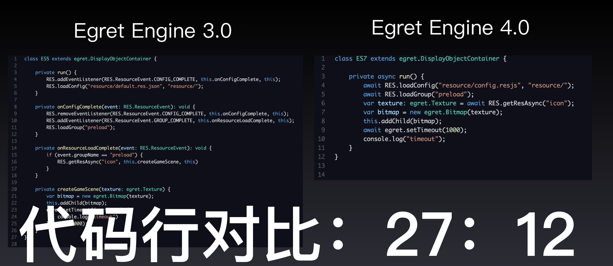

白鹭引擎 4.0.0 发布日志
===============================


最近更新时间：2017年1月10日


欢迎您使用白鹭引擎

## 概述

白鹭引擎包含了白鹭时代研发的遵循HTML5标准的游戏引擎。他包括 2D / 3D 渲染核心、GUI体系、音频管理、资源管理等游戏引擎的常用模块。

通过使用白鹭引擎，开发者可以尽可能的不用关注浏览器的底层实现，解决HTML5游戏性能问题及碎片化问题，灵活地满足开发者开发2D或3D游戏的需求。

## 更新内容

* 完善 TypeScriptCompiler 2.1.4 核心
    * 允许开发者使用 ES2015 语法，如 async / await / Reflection / Map / Promise 等
    * 完善白鹭引擎的库定义文件，帮助开发者更好的利用 TypeScript 的强类型进行类型推断
    * 修复部分构建BUG
    * 修复若干文件排序的问题
    * 修复了枚举中不能有 DEBUG 字符的BUG
    * 编译器报错支持多语言
    * 重构内部逻辑，为未来进一步扩展做准备
    
    以下是 TypeScript 2.1.4 在白鹭引擎中的部分典型应用
    
    

* 资源管理框架
    * 更易用的资源加载 API
    * 版本控制与热更新支持
    * 针对不同平台发布不同的资源
    * 更容易开发者进行扩展的结构
    * 80% 兼容旧版 API
    * 更多内容请参见[这里](https://github.com/egret-labs/resourcemanager)

    通过使用新的资源管理框架，可以帮助开发者节省超过30%的流量开销，从而提升HTML5游戏的用户转化率、降低服务器运维费用
    
    

* 骨骼动画-白鹭极速格式
    * 大幅提升骨骼动画的性能，与之前版本相比矩阵计算性能提升超过3倍，在低端机上甚至可以达到5倍
    * 大幅降低骨骼动画的内存占用，与之前版本相比内容占用降低超过70%

    示例如下：
    

* Facebook Instant Game
    
    提供 Facebook Instant Game 模板，帮助开发者开发基于 Facebook Instant Game 的游戏 
    
    Faceook Instant Game 是一项尚未全面开放的功能，开发者如果想基于其构建游戏，请继续关注 Facebook 的下一步策略，或与白鹭引擎官方团队联系。

    

* 命令行工具
    * 修复执行 ``` egret create_app ``` 命令在 windows 上执行，如果不在同一个盘符可能报错的 BUG

* EXML / EUI
    * 添加 Style 的机制，允许开发者通过设置 Style 的方式批量修改皮肤样式，提升开发效率

## 路线图

白鹭引擎将在未来的半年内，重点解决以下问题：

* 将白鹭引擎进一步向 ES2015+ / npm 、标准 TypeScript 方向靠拢，提升开发者的开发效率。
* 引入模块化策略，允许开发者针对特定模块进行升级，以便尽可能降低已经在生产环境运行的游戏因为升级引擎带来潜在问题。
* 融合白鹭引擎的 2D 与 3D 渲染，并提升渲染核心的可扩展性，允许开发者更灵活的进行定制特效。
* 进一步完善资源管理框架，帮助开发者提升对资源加载、释放方面的开发效率，并降低流量消耗。
* 与 Egret Wing 配合，进一步完善 EXML / EUI 的机制，帮助开发者提升 UI 的开发与渲染效率。
* 重点解决开发者在2016年集中反馈的问题，具体链接参见[这里](http://bbs.egret.com/thread-25005-1-1.html)

## 相关其他内容
* 白鹭引擎4.0 需要最新的 Egret Wing 4.0 配合，或将 WebStrom 等其他开发工具升级至较新版本以支持 TypeScript 2.1
* 骨骼动画的白鹭极速模式需要开发者将 DragonBonesPro 升级至4.8版本以上，建议使用最新的 5.0 版本
* 使用白鹭引擎开发原生游戏的工具（ egret-ios-support / egret-android-support ）将会很快以 Egret-Native的全新面貌发布