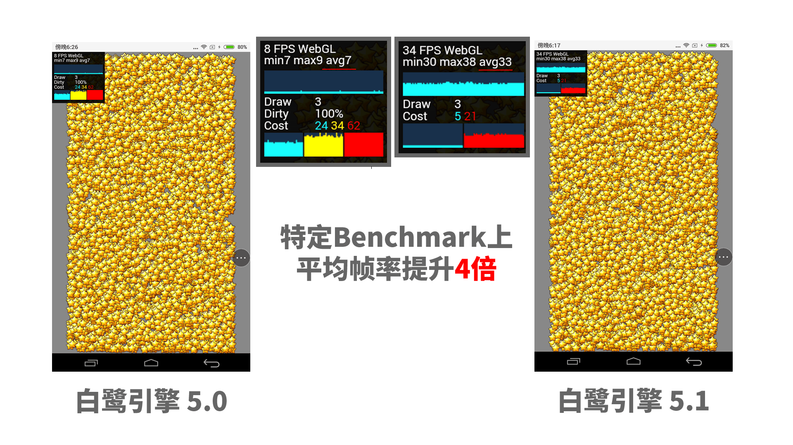

# 白鹭引擎 5.1 发布日志


---

白鹭引擎在 2017年5月份正式发布了 5.0 版本，经过了14个小版本的不断迭代，逐步向开发者提供了以下功能：

* WebAssembly 渲染器 beta，显著提升游戏渲染效率
* 文字与矢量渲染优化，显著提升大屏幕手机对文字和矢量渲染的清晰度
* 大幅提升 DragonBones 骨骼动画的运行性能
* 提升 EUI 项目的编译速度
* 解决部分 iOS 设备用户在激活输入文本后渲染异常的问题


目前，以上功能均已稳定，白鹭引擎接下来会采用双版本迭代的策略。一方面不断完善 5.0.x 版本，不引入任何新功能，专注在稳定性提升，错误修正以及不破坏整体结构的小幅性能优化。另一方面，引擎发布了包含新特性的 5.1 版本。


对游戏开发者而言，如果您的游戏已经发布或者即将发布，我推荐您使用稳定版，如果您的游戏刚开始使用白鹭引擎做新项目、或者迫切的需要一些新特性，您可以使用 5.1 版本。 我们开发团队会根据收集开发者的反馈对 5.1 版本进行完善。如果您在使用 5.1 版本时遇到任何问题或者有什么建议，请随时与白鹭官方团队保持联系，以便第一时间由白鹭团队帮助您解决遇到的这些问题。

当 5.1 版本逐步稳定之后，白鹭引擎官方会提供从 5.0.x 到 5.1.x 的升级指导。


由于目前 HTML5 游戏愈发重度化，白鹭引擎这几个月也做了诸多具有针对性的改进，提升重度游戏的开发体验。我们认为，开发一款重度游戏，目前主要仍然存在着以下痛点需要解决：

* 重度游戏构建速度过慢
* 构建工作流不易扩展
* 游戏运行性能需要进一步提高


接下来向各位开发者介绍白鹭引擎 5.1 版本引入的全新功能。


# 优化渲染性能，游戏整体帧频提升 10%

白鹭引擎在 5.0 版本引入了 WebAssembly 渲染器，大幅提升了游戏的渲染性能。在这个过程中，白鹭团队也总结了更多的 HTML5 游戏渲染优化策略，并将这些策略应用到了现有的 JavaScript 渲染模块上。简而言之，白鹭引擎 5.1 版本的 JavaScript 渲染器得到了进一步的性能提升，在特定 Benchmark 上尤为明显，提升超过三倍



在实际游戏项目中，由于游戏的渲染列表远比特定 benchmark 复杂，并且游戏业务逻辑开销也会占用不少性能，经过我们实际在游戏项目中的测试，我们推论这项改动对您的整体游戏性能会带来 10% 左右的性能提升。


# 新的编译器架构，更方便定制的工作流

白鹭引擎 5.1 采用了新的命令行架构，重点调整了```egret build```与```egret publish```命令，并将命令行重命名为白鹭编译器。

在之前的版本中，白鹭引擎的构建与发布命令对开发者而言是一个黑盒，开发者只能了解到当您执行了 ```egret build```以及```egret publish```之后，经过一段短暂（或者漫长）的等待时间后，您的源代码和资源就会神奇的生成到一些特定的位置上。当开发者有需要对引擎的发布进行扩展的需求时，您无法对引擎的发布过程进行定制，只能自己编写一些脚本，并将白鹭引擎的发布过程作为您编写的脚本中的一部分。


在新版本中，白鹭编译器构建的所有行为都变成了插件，并直接将插件的执行顺序暴露给您，具体机制如下：

项目结构包含了如下修改

```
egret-project
    |-- src // 源代码
    |-- resource // 资源
    |-- scripts // 构建脚本
        |-- api.d.ts // 文档
        |-- config.ts // 构建脚本入口
```

在```config.ts```中包含了如下代码：

```
export const config = {

    buildConfig: (params) => {
        return {
                outputDir,
                commands: [
                    new ExmlPlugin(),
                    new CompilePlugin(),
                    new UglifyPlugin()
                ]
        }
    }
} 

```

通过上述代码，我们可以很清晰的看出，引擎发布会先后执行 EXML 构建、源代码编译、代码混淆这三个步骤。这样一方面您可以了解到命令行中到底执行了什么，另一方面您也可以轻松的去调整这些配置。

在下个小版本中，我们将会允许开发者加入您自己的插件，去扩展整个发布过程。

# 重构优化构建逻辑，提升构建速度

在新的编译器开发过程中，我们优化了编译器的内部构建逻辑，以解决大型项目编译速度缓慢的问题。由于引入了虚拟文件系统作为编译器对底层硬盘数据的抽象，新的编译器在执行增量编译的速度会得到大约10%的构建速度提升，在老式的机械硬盘上会更加显著。

除此之外，由于使用了基于流的文件处理机制，引擎的发布速度得到了大幅的提升，通过白鹭引擎与一款重度游戏的技术合作为例，该项目中包含了11000余个文件，500兆资源，发布一次原生版本的发布速度从 150秒减少至 50 秒。

这次版本只是我们对构建速度优化的第一步，接下来我们会逐步进一步完善提升引擎的构建速度。


# 项目配置文件梳理，更易理解的产品体验

每一个白鹭引擎项目中均包含一个```egretProperties.json```文件，这个文件之前会包含了一个名为```egret_version```的字段，用于指定采用哪个版本的白鹭引擎进行编译。


在 5.1 版本中，我们引入了两个新的字段，分别是```compilerVersion```与```engineVersion```分别表示引擎编译器的版本与引擎运行时库的版本。原有的```egret_version```字段在新版本中将被废弃。

这种修改是为了更清晰的表达“编译器”与“引擎”是两个不同的概念。编译器指执行 egret build / egret publish 等开发者需要的命令，而引擎指 egret.js / eui.js 等游戏运行所需要的 JavaScript 脚本。而之前的 " egret_version " 无法清晰的表达这个概念。


从 5.1 版本开始，我们建议开发者使用最新的编译器版本，以及相对稳定的引擎版本。由于保证了引擎和编译器的独立性，白鹭可以为开发者提供更多有价值的功能，因此，开发者完全无需担心您的现有项目无法使用新的编译器架构。


# 更多功能敬请期待

白鹭引擎 5.1 版本将在接下来的一个月内逐步发布一些振奋人心的新特性，包括：

* 将内置的资源加载模块切换至 Egret ResourceManager
* 改善 EUI 的加载速度和资源尺寸
* 大幅提升原生App 的运行性能
* 更多的发布平台支持
* 更快的构建速度


于此同时，我们也会继续完善 5.0.x 版本，进一步改善您现有项目的稳定性。